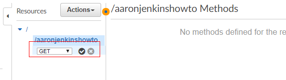
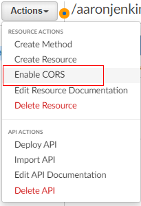

# Lambda λ Functions as Rest API
In this guide, I will show you how to create a Lambda function on AWS and set up an Rest API Trigger to quickly build APIs for your application

## Building Your First Function 
1. Define
    - Name: pick a name for your function, it can be anything you want
    - Runtime: pick a programming language for your new function 
2. Click 'Create Function' button
3. This will create a simple 'Hello World' Lambda Function

## Testing your Function 
1. Test 
    - Click the Test button to set up a test\
    
    - Add 'Event Name'
    - Click 'Create' button\
    
2. Click the test button again to run the function\

## Add API Gateway
1. Click 'Add Trigger' button\

2. Select 'API Gateway' from the dropdown 
3. Select 'Create a new API' from the dropdown 
    - Choose 'Rest API'
    - Choose 'Open with API Key' for security
4. Click 'Add' button\

## Call your new API via Postman 
1. Expand the Details section title 'API-Gateway'
2. Copy the url into a postman request
3. Add a header to the request called 'x-api-key' and paste the api key value\

5. Click send, and you should get a 200 response and see 'Hello from Lambda!' as the response\

## API Gateway Proper Setup
By default the endpoint create accepts all method types(get, post, put etc) you should set it up to be a proper end point with 1 accepted method type
1. Go to API Gateway 
2. Click on the 'Any' Method and select 'Delete Resource' from the Actions dropdown\

3. From the Actions Dropdown choose 'Create Method'\

    - From the new dropdown that appears, choose Get and click the checkbox to create\
    
    - Choose 'Lambda Function' and type the name of the Lambda Function you created\
    
4. Under 'Method Request' you will want to set API Key Required = true\
   
5. Now from the Actions dropdown click 'Deploy', choose 'Default' and click 'Deploy'

If you want to use this API call with a VUE or React app:\
    - Select Enable CORS from the actions dropdown\
    \
    - Click the checkboxes for 'DEFAULT 4XX' & 'DEFAULT 5XX'
    - And click the blue 'Enabled CORS' button\
    \
    - DON"T FORGET to deploy your API Again