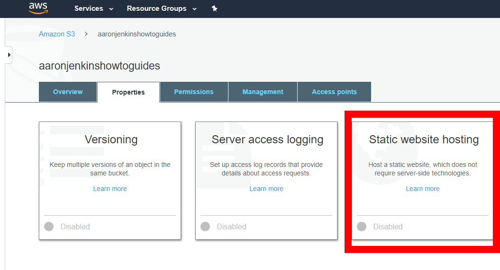

# Webhosting on AWS S3
In this guide I will show you how to host a static website on S3 and how to set up the automated build process to deploy it there. 

This can be useful for a few things. 
- Very cheap hosting for simple projects—[S3 Pricing Guide](https://aws.amazon.com/s3/pricing/)
- Fast deployment of sites to test on mobile devices
- Site prototyping and demonstration

## Create VUE or React app

- This guide provides instructions for VUE and React projects. Other projects can be used, but you will need to determine how to edit the `buildspec.yml` file in the next step to work with your project.
- [Create React Project](https://reactjs.org/docs/create-a-new-react-app.html)
- [Create Vue Project](https://cli.vuejs.org/guide/creating-a-project.html)

## Changes to your Repo

- A buildspec.yml must be added to your repo
- Download this file and add it at the root directory—[buildspec.yml · GitHub](https://gist.github.com/aaronjenkins/197e46cb58dd77c2ba4a817139f4d856)
- Be sure to uncomment the base-directory line that is appropriate for your app
  - 'dist' for VUE
  - 'build' for React
- Don't forget to check in this new file to your repo
- [Build specification reference for CodeBuild - AWS CodeBuild](https://docs.aws.amazon.com/codebuild/latest/userguide/build-spec-ref.html)
  

# Setting up your S3 Bucket

## 1. Create the bucket
  - Be sure to uncheck 'Block all Public Access' checkbox, since you will want to be able to publicly access your website
  - Click the checkbox in the warning box to acknowledge you understand
  - WARNING: this will allow the files from your bucket to be accessed publicly, so DO NOT put any information or files in this bucket that you don't want to be publicly accessible

   
## 2. Setup as website

  - Go to Properties > Static Webhosting > 'Use this bucket to host a website' & enter index.html\

    
    
  - Remember the generated URL, it will be how you access the website later

## 3. Edit Permissions

- Go to Permissions > Bucket Policy and paste in the content of this—[s3 public bucket policy · GitHub](https://gist.github.com/aaronjenkins/a4d0791944ad0e83c7658fc9c1a88514)
- Be sure to change 'yourbucketnamehere' to that name of the bucket you created

# Pipeline: Create the Pipeline

## 1. Pipeline Name

  - Name of your app
  - Service Role: New Service Role
  - Role Name: leave default
  - Allow AWS Code Pipeline to create a service role so it can be used with this new pipeline : true
  - Advanced Settings:
    - Artifact Store: Default
    - Encryption Key: default AWS Managed key

## 2. Source

  - Choose Github and link your github account so you can access your repos easily
  - Repository: your app repo
  - Branch: master
  - Detection Options: GitHub Webhooks

## 3. Create the Build

  - Choose AWS Code Build
  - Click the create project button
  - Give it a name you will remember\

  
  - Choose the following under Environment section
    - Managed Image
    - Operating System: Amazon Linux 2
    - Runtime: Standard
    - Image: aws/codebuild/amazonlinux2-x86_64-standard:2.0
    - Image Version: Always use the latest
    - Environment Type: Linux
    - Service Role: New Service Role
    - Role Name: (leave as default)
  - Build Spec - choose 'use buildspec file'\

  

## 4. Deploy

  - Provider: Amazon S3
  - Region: US East (Ohio) -or- closest to you
  - Bucket: public bucket you created earlier
  - Deployment path: leave blank
  - Extract file before deploy: true

## 5. Review & Create
  - Click create pipeline at the bottom of step five and that should be it, go to the url you got from step two of setting up your bucket
